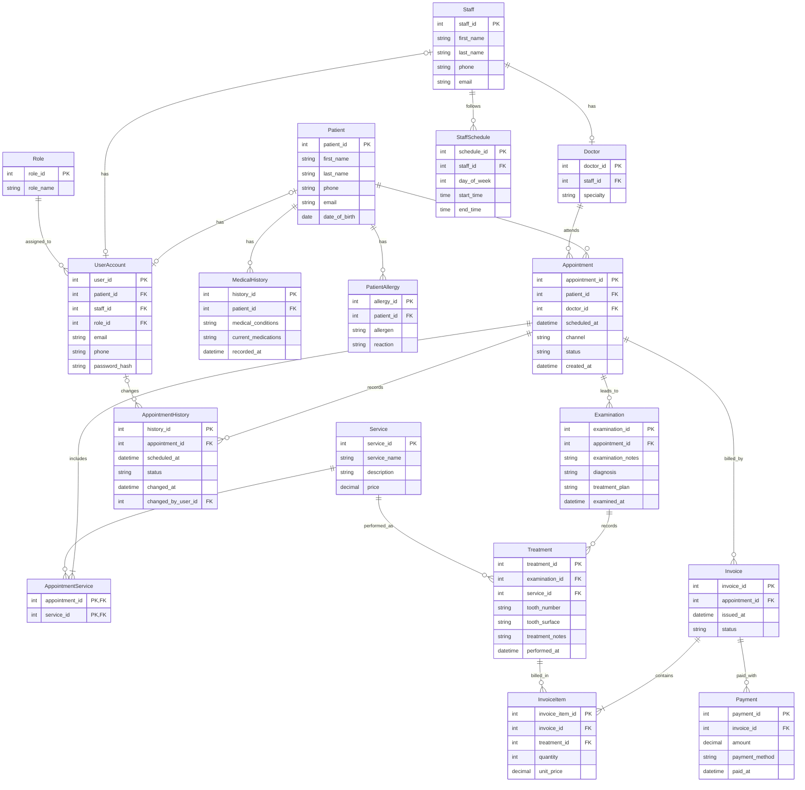

# Dental Clinic Database System — Entities
SRS-ээс олсон entity-үүдийн эхний бүтэц, атрибут болон түлхүүрийг тодорхойлов.
## 1. Patient
||Түлхүүр|
|---|---|
|patient_id|PK|
|first_name||
|last_name||
|phone||
|email||
|date_of_birth||

## 2. Role
||Түлхүүр|
|---|---|
|role_id|PK|
|role_name||

## 3. Staff
||Түлхүүр|
|---|---|
|staff_id|PK|
|first_name||
|last_name||
|phone||
|email||

## 4. Doctor
||Түлхүүр|
|---|---|
|doctor_id|PK|
|staff_id|FK|
|specialty||

## 5. UserAccount
||Түлхүүр|
|---|---|
|user_id|PK|
|patient_id|FK|
|staff_id|FK|
|role_id|FK|
|email||
|phone||
|password_hash||

## 6. MedicalHistory
||Түлхүүр|
|---|---|
|history_id|PK|
|patient_id|FK|
|medical_conditions||
|current_medications||
|recorded_at||

## 7. PatientAllergy
||Түлхүүр|
|---|---|
|allergy_id|PK|
|patient_id|FK|
|allergen||
|reaction||

## 8. Service
||Түлхүүр|
|---|---|
|service_id|PK|
|service_name||
|description||
|price||

## 9. StaffSchedule
||Түлхүүр|
|---|---|
|schedule_id|PK|
|staff_id|FK|
|day_of_week||
|start_time||
|end_time||

## 10. Appointment
||Түлхүүр|
|---|---|
|appointment_id|PK|
|patient_id|FK|
|doctor_id|FK|
|scheduled_at||
|channel||
|status||
|created_at||

## 11. AppointmentService
||Түлхүүр|
|---|---|
|appointment_id|PK, FK|
|service_id|PK, FK|

## 12. AppointmentHistory
||Түлхүүр|
|---|---|
|history_id|PK|
|appointment_id|FK|
|scheduled_at||
|status||
|changed_at||
|changed_by_user_id|FK|

## 13. Examination
||Түлхүүр|
|---|---|
|examination_id|PK|
|appointment_id|FK|
|examination_notes||
|diagnosis||
|treatment_plan||
|examined_at||

## 14. Treatment
||Түлхүүр|
|---|---|
|treatment_id|PK|
|examination_id|FK|
|service_id|FK|
|tooth_number||
|tooth_surface||
|treatment_notes||
|performed_at||

## 15. Invoice
||Түлхүүр|
|---|---|
|invoice_id|PK|
|appointment_id|FK|
|issued_at||
|status||

## 16. InvoiceItem
||Түлхүүр|
|---|---|
|invoice_item_id|PK|
|invoice_id|FK|
|treatment_id|FK|
|quantity||
|unit_price||

## 17. Payment
||Түлхүүр|
|---|---|
|payment_id|PK|
|invoice_id|FK|
|amount||
|payment_method||
|paid_at||

# Entity Relationships

# Entity Relationships

| Нэг тал | Холбоо | Нөгөө тал |
|---|---|---|
| Patient (Өвчтөн) | 1:N | Appointment (Цаг захиалга) |
| Doctor (Эмч) | 1:N | Appointment (Цаг захиалга) |
| Appointment (Цаг захиалга) | 1:N | AppointmentService (Захиалгын үйлчилгээ) |
| Service (Үйлчилгээ) | 1:N | AppointmentService (Захиалгын үйлчилгээ) |
| Staff (Ажилтан) | 1:1 | Doctor (Эмч) |

| Нэг тал | Холбоо | Нөгөө тал |
|---|---|---|
| Patient (Өвчтөн) | 1:1 | UserAccount (Нэвтрэх бүртгэл) |
| Staff (Ажилтан) | 1:1 | UserAccount (Нэвтрэх бүртгэл) |
| Role (Эрхийн төрөл) | 1:N | UserAccount (Нэвтрэх бүртгэл) |
| Patient (Өвчтөн) | 1:N | MedicalHistory (Эрүүл мэндийн мэдээлэл) |
| Patient (Өвчтөн) | 1:N | PatientAllergy (Өвчтөний харшил) |

| Нэг тал | Холбоо | Нөгөө тал |
|---|---|---|
| Staff (Ажилтан) | 1:N | StaffSchedule (Ажилтны хуваарь) |
| Appointment (Цаг захиалга) | 1:N | AppointmentHistory (Захиалгын түүх) |
| UserAccount (Нэвтрэх бүртгэл) | 1:N | AppointmentHistory (Захиалгын түүх) |
| Appointment (Цаг захиалга) | 1:N | Examination (Үзлэг) |
| Examination (Үзлэг) | 1:N | Treatment (Эмчилгээ) |

| Нэг тал | Холбоо | Нөгөө тал |
|---|---|---|
| Service (Үйлчилгээ) | 1:N | Treatment (Эмчилгээ) |
| Appointment (Цаг захиалга) | 1:N | Invoice (Нэхэмжлэл) |
| Invoice (Нэхэмжлэл) | 1:N | InvoiceItem (Нэхэмжлэлийн мөр) |
| Treatment (Эмчилгээ) | 1:N | InvoiceItem (Нэхэмжлэлийн мөр) |
| Invoice (Нэхэмжлэл) | 1:N | Payment (Төлбөр) |

# Dental Clinic Database System — Draft ERD

