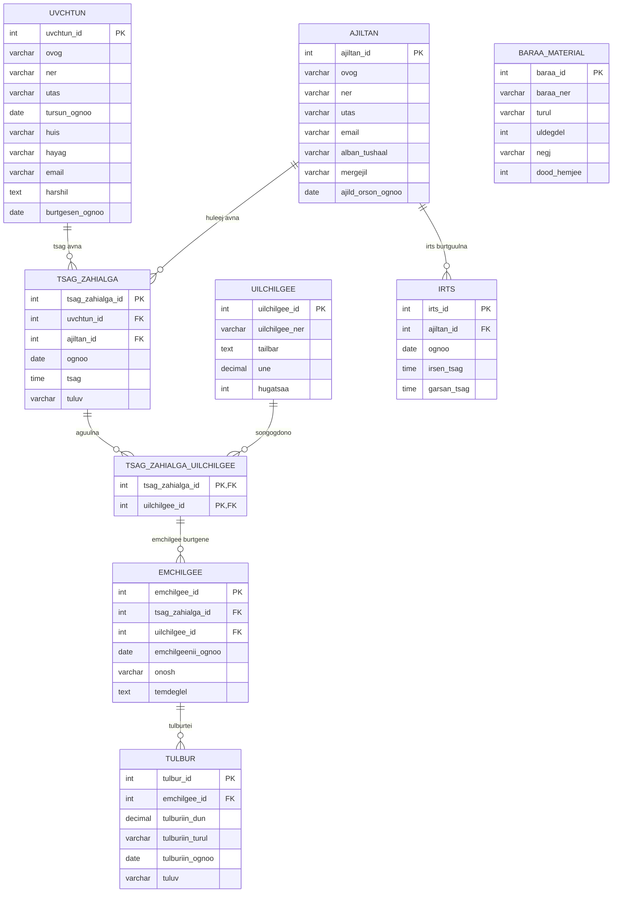

# Dental Clinic System ERD

## Entity-үүд

### Uvchtun

```text
uvchtun_id PK
ovog
ner
utas
tursun_ognoo
huis
hayag
email
harshil
burtgesen_ognoo
```

### Ajiltan

```text
ajiltan_id PK
ovog
ner
utas
email
alban_tushaal
mergejil
ajild_orson_ognoo
```

### TsagZahialga

```text
tsag_zahialga_id PK
uvchtun_id FK
ajiltan_id FK
ognoo
tsag
tuluv
```

### Uilchilgee

```text
uilchilgee_id PK
uilchilgee_ner
tailbar
une
hugatsaa
```

### TsagZahialgaUilchilgee

```text
tsag_zahialga_id PK, FK
uilchilgee_id PK, FK
```

Энэ хоёр багана нийлж нэг нийлмэл Primary Key болно.

### Emchilgee

```text
emchilgee_id PK
tsag_zahialga_id FK
uilchilgee_id FK
emchilgeenii_ognoo
onosh
temdeglel
```

`(tsag_zahialga_id, uilchilgee_id)` нь нийлмэл Foreign Key бөгөөд
`TsagZahialgaUilchilgee` хүснэгтийн нийлмэл Primary Key-г заана.
Ингэснээр тухайн захиалгад сонгосон үйлчилгээгээр эмчилгээ бүртгэнэ.

### Tulbur

```text
tulbur_id PK
emchilgee_id FK
tulburiin_dun
tulburiin_turul
tulburiin_ognoo
tuluv
```

### Irts

```text
irts_id PK
ajiltan_id FK
ognoo
irsen_tsag
garsan_tsag
```

### BaraaMaterial

```text
baraa_id PK
baraa_ner
turul
uldegdel
negj
dood_hemjee
```

---

# Relationship

```text
Uvchtun 1:N TsagZahialga

Ajiltan 1:N TsagZahialga

TsagZahialga 1:N TsagZahialgaUilchilgee
Uilchilgee 1:N TsagZahialgaUilchilgee

TsagZahialgaUilchilgee 1:N Emchilgee

Emchilgee 1:N Tulbur

Ajiltan 1:N Irts
```

`TsagZahialga` болон `Uilchilgee` нь M:N холбоотой.
Энэ холбоог `TsagZahialgaUilchilgee` хүснэгтээр хэрэгжүүлсэн.

Одоогийн SQL бүтэц нь нэг захиалгын нэг үйлчилгээнд олон
эмчилгээний бүртгэл оруулах боломжтой.

`BaraaMaterial` одоогоор бусад entity-тэй шууд холбоогүй тусдаа хүснэгт байна.

---

# Mermaid ER Diagram


