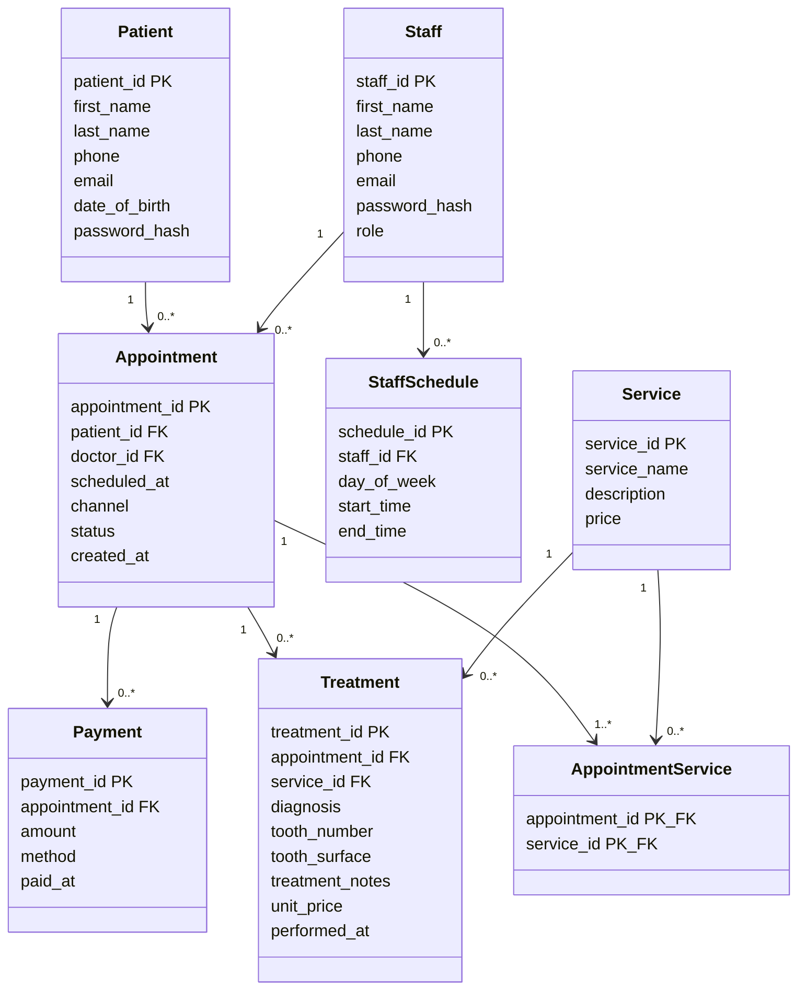

```mermaid
classDiagram
    Patient "1" --> "0..*" Appointment
    Staff "1" --> "0..*" StaffSchedule
    Staff "1" --> "0..*" Appointment
    Appointment "1" --> "1..*" AppointmentService
    Service "1" --> "0..*" AppointmentService
    Appointment "1" --> "0..*" Treatment
    Service "1" --> "0..*" Treatment
    Appointment "1" --> "0..*" Payment

    class Patient {
        patient_id PK
        first_name
        last_name
        phone
        email
        date_of_birth
        password_hash
    }

    class Staff {
        staff_id PK
        first_name
        last_name
        phone
        email
        password_hash
        role
    }

    class Service {
        service_id PK
        service_name
        description
        price
    }

    class StaffSchedule {
        schedule_id PK
        staff_id FK
        day_of_week
        start_time
        end_time
    }

    class Appointment {
        appointment_id PK
        patient_id FK
        doctor_id FK
        scheduled_at
        channel
        status
        created_at
    }

    class AppointmentService {
        appointment_id PK_FK
        service_id PK_FK
    }

    class Treatment {
        treatment_id PK
        appointment_id FK
        service_id FK
        diagnosis
        tooth_number
        tooth_surface
        treatment_notes
        unit_price
        performed_at
    }

    class Payment {
        payment_id PK
        appointment_id FK
        amount
        method
        paid_at
    }
```
